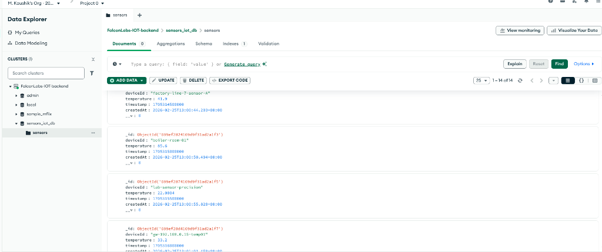
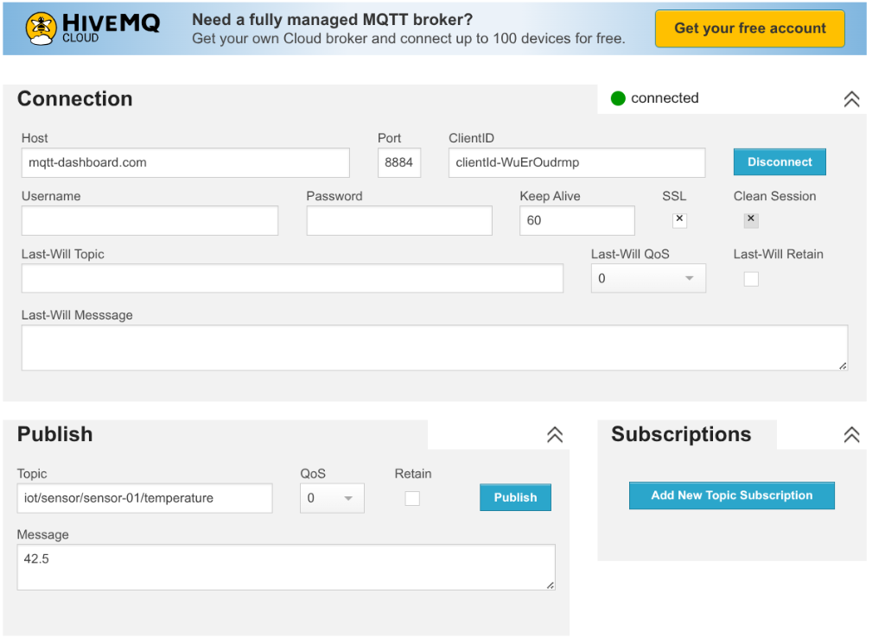
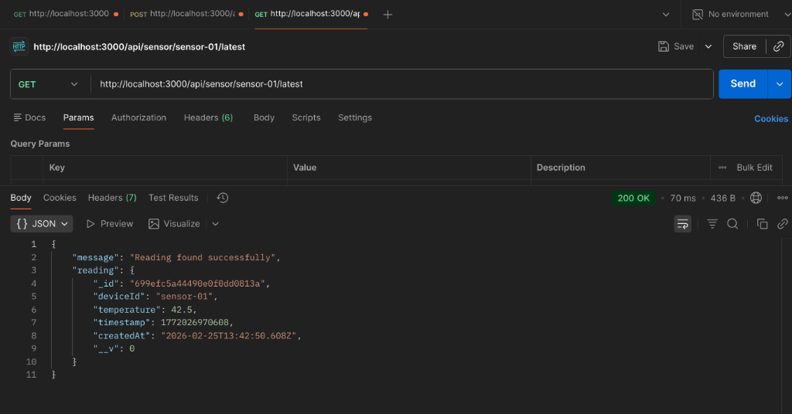

# 🌡️ IoT Sensor Data Backend

A Node.js backend service for ingesting IoT sensor data via **REST API** and **MQTT**, with persistence in **MongoDB Atlas**.

---

## 📋 Project Overview

**Objective:** Build a lightweight backend that accepts temperature readings from IoT devices through two channels:

1. **REST API** — HTTP endpoints for ingesting and querying sensor data.
2. **MQTT Subscriber** — Listens to a public MQTT broker and automatically stores incoming temperature readings.

All data is persisted in a MongoDB Atlas collection (`sensors`).

#### 🗄️ MongoDB Atlas — Sensor Data



### Tech Stack

| Layer        | Technology                 |
| ------------ | -------------------------- |
| Runtime      | Node.js 20 LTS (ES Modules) |
| Framework    | Express 5                  |
| ODM          | Mongoose 9                 |
| MQTT Client  | MQTT.js 5                  |
| Database     | MongoDB Atlas              |
| Dev Tooling  | Nodemon, dotenv            |

---

## 🚀 Setup and Installation

### Prerequisites

- **Node.js** v18+ or v20 LTS (recommended)
- **npm** (comes with Node.js)
- A **MongoDB Atlas** cluster (free tier works fine)

### Installation

```bash
# 1. Clone the repository
git clone https://github.com/kaushik87599/FalconLabs-IOT-backend-assignment.git
cd FalconLabs-IOT-backend-assignment

# 2. Install dependencies
npm install

# 3. Create your .env file (see below)

# 4. Start the development server
npm run dev
```

### Environment Variables

Create a `.env` file in the project root with the following keys:

```env
MONGODB_URI=mongodb+srv://<username>:<password>@<cluster>.mongodb.net/<dbname>?appName=<appName>
PORT=3000
```

| Variable       | Description                                   | Required |
| -------------- | --------------------------------------------- | -------- |
| `MONGODB_URI`  | MongoDB Atlas connection string               | ✅       |
| `PORT`         | Port the Express server listens on (default: `3000`) | ❌       |

---

## 📡 API Documentation

**Base URL:** `http://localhost:3000`

### 1. Ingest a Sensor Reading

**`POST /api/sensor/ingest`**

Accepts a sensor reading and stores it in the database.

**Request Body:**

```json
{
  "deviceId": "sensor-01",
  "temperature": 29.5,
  "timestamp": 1716312000000
}
```

| Field         | Type     | Description                        | Required |
| ------------- | -------- | ---------------------------------- | -------- |
| `deviceId`    | `string` | Unique identifier for the device   | ✅       |
| `temperature` | `number` | Temperature reading (°C)           | ✅       |
| `timestamp`   | `number` | Unix epoch timestamp (milliseconds)| ❌ (optional) |

> If `timestamp` is not provided, the server defaults to `Date.now()`.

**Success Response — `201 Created`:**

```json
{
  "message": "Reading ingested successfully"
}
```

**Error Response — `400 Bad Request`:**

```json
{
  "message": "deviceId must be a non-empty string"
}
```

or

```json
{
  "message": "temperature must be a number"
}
```

---

### 2. Get Latest Reading for a Device

**`GET /api/sensor/:deviceId/latest`**

Returns the most recent reading for the specified device, sorted by timestamp (descending).

**URL Parameter:**

| Parameter  | Type     | Description                      |
| ---------- | -------- | -------------------------------- |
| `deviceId` | `string` | Unique identifier for the device |

**Success Response — `200 OK`:**

```json
{
  "message": "Reading found successfully",
  "reading": {
    "_id": "...",
    "deviceId": "sensor-01",
    "temperature": 29.5,
    "timestamp": 1716312000000,
    "createdAt": "2026-02-25T13:00:00.000Z",
    "__v": 0
  }
}
```

**Error Response — `404 Not Found`:**

```json
{
  "message": "No reading found for this device"
}
```

---

## 📡 MQTT Bonus Task

The server includes a built-in MQTT subscriber that listens for temperature data on a **public HiveMQ broker**.

| Setting  | Value                                    |
| -------- | ---------------------------------------- |
| Broker   | `broker.hivemq.com`                      |
| Port     | `8884`                                   |
| Topic    | `iot/sensor/<deviceId>/temperature`      |
| Wildcard | `iot/sensor/+/temperature`               |

### How It Works

1. On server startup, the MQTT client connects to `broker.hivemq.com`.
2. It subscribes to the topic `iot/sensor/+/temperature` (the `+` wildcard matches any `deviceId`).
3. When a message arrives:
   - The `deviceId` is extracted from the topic (3rd segment).
   - The message payload is parsed as a `float` temperature value.
   - A new `Sensor` document is created and saved to the MongoDB `sensors` collection.
4. Invalid (non-numeric) payloads are caught and logged without crashing the server.

### Publishing a Test Message

You can use the [HiveMQ Web Client](http://www.hivemq.com/demos/websocket-client/) or any MQTT client to publish a test message:



Alternatively, you can use the [MQTTX](https://mqttx.app/) desktop app or CLI:

```bash
# Install MQTTX CLI (optional)
npm install -g @emqx/mqttx-cli

# Publish a test temperature reading
mqttx pub -h broker.hivemq.com -t "iot/sensor/sensor-42/temperature" -m "36.7"
```

You should see the following log in your server console:

```
MQTT Ingest: Saved 36.7°C for sensor-42
```

---

## 🧪 Testing Examples

### REST API — Ingest a Reading (curl)

```bash
curl -X POST http://localhost:3000/api/sensor/ingest \
  -H "Content-Type: application/json" \
  -d '{
    "deviceId": "sensor-01",
    "temperature": 29.5,
    "timestamp": 1716312000000
  }'
```

### REST API — Ingest Without Timestamp (auto-generated)

```bash
curl -X POST http://localhost:3000/api/sensor/ingest \
  -H "Content-Type: application/json" \
  -d '{
    "deviceId": "sensor-02",
    "temperature": 31.2
  }'
```

**Expected Response:**

```json
{ "message": "Reading ingested successfully" }
```

> The server auto-generates the `timestamp` field using `Date.now()`.

**Expected Response:**

```json
{ "message": "Reading ingested successfully" }
```

### REST API — Get Latest Reading (curl)

```bash
curl http://localhost:3000/api/sensor/sensor-01/latest
```

**Expected Response:**

```json
{
  "message": "Reading found successfully",
  "reading": {
    "_id": "...",
    "deviceId": "sensor-01",
    "temperature": 29.5,
    "timestamp": 1716312000000,
    "createdAt": "2026-02-25T13:00:00.000Z",
    "__v": 0
  }
}
```

### Postman

1. **POST** `http://localhost:3000/api/sensor/ingest`
   - Set **Body → raw → JSON** and paste the payload above.
2. **GET** `http://localhost:3000/api/sensor/sensor-01/latest`
   - No body needed — just send the request.



---

## 📁 Project Structure

```
Falcon-assignment/
├── configs/
│   └── db.js               # MongoDB Atlas connection setup
├── controllers/
│   └── controllers.js       # Request handlers (ingest & latest)
├── models/
│   └── Sensor.js            # Mongoose schema for sensor readings
├── routes/
│   └── sensorRoutes.js      # Express route definitions
├── screenshots/             # Demo screenshots for documentation
│   ├── hivemq-mqtt-publish.png
│   ├── mongodb-atlas-sensors.png
│   └── postman-get-latest.png
├── utils/
│   └── mttqSubcriber.js     # MQTT subscriber (HiveMQ broker)
├── .env                     # Environment variables (not committed)
├── .gitignore
├── index.js                 # Application entry point
├── package.json
└── README.md
```

---

## 🧩 Assumptions

- `deviceId` uniquely identifies a device
- `temperature` is in Celsius
- `timestamp` is in milliseconds (Unix epoch)
- MQTT payload must contain a numeric temperature value only
- A single MongoDB Atlas cluster is used for all environments

---

## 📝 License

ISC